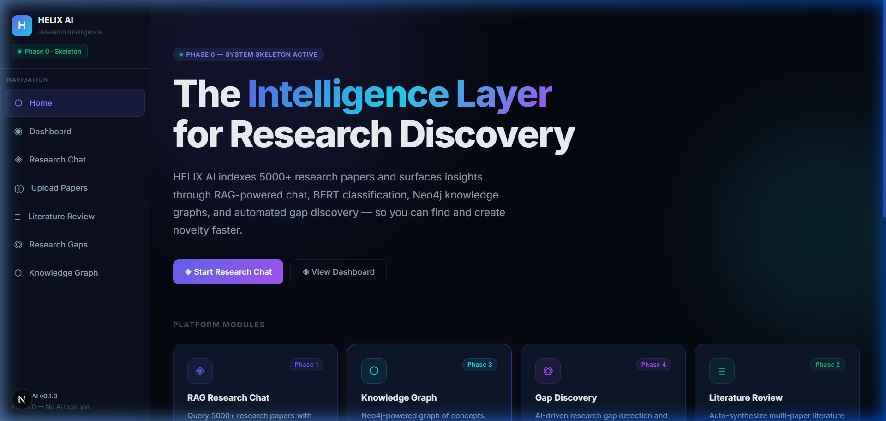
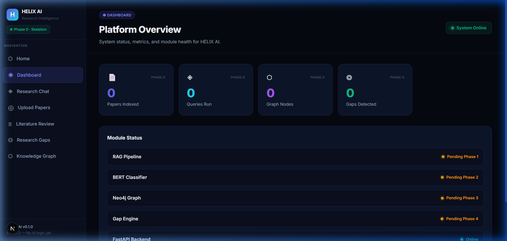
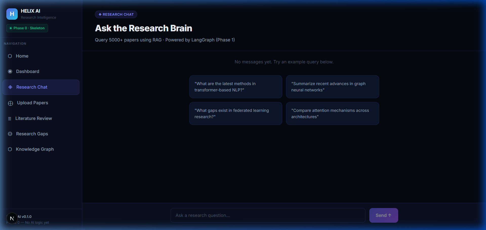
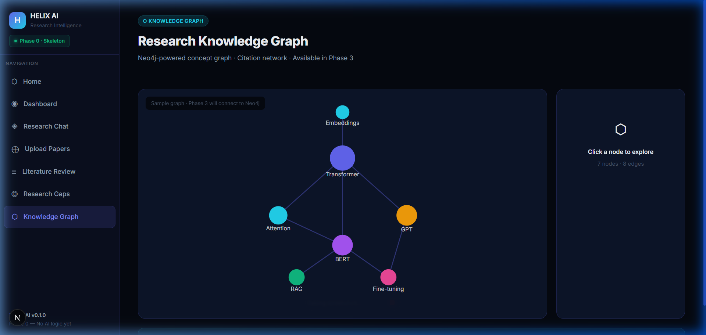
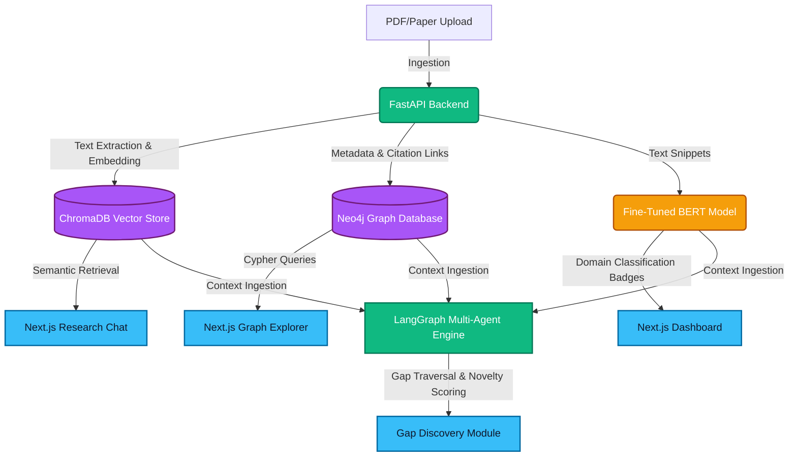

# 🌌 ASTRA (HELIX AI) — Research Intelligence Platform

### *Automating academic discovery: indexing papers, fine-tuning BERT classifiers, building Neo4j knowledge graphs, and discovering research gaps via LangGraph multi-agent systems.*

<div align="center">


</div>

---

## 🌌 Project Overview

**ASTRA (HELIX AI)** is a full-stack **Research Intelligence Platform** designed to ingest thousands of scientific papers, parse semantic relations, index vectors, and surface hidden connections in scientific literature. By uniting retrieval-augmented generation (RAG), domain-specific classification, graphical representations, and agentic reasoning, ASTRA provides researchers with a command center for discovering unexplored academic opportunities.

### Key Capabilities
*   💬 **RAG Research Chat:** Engage with a corpus of 5000+ indexed papers using vector-based retrieval.
*   🏷️ **Paper Classification:** Automatic domain classification using a fine-tuned Hugging Face BERT model.
*   📝 **Literature Review Synthesis:** Multi-document analysis and citation-backed synthesis.
*   🕸️ **Interactive Knowledge Graph:** Neo4j visualization mapping concepts, citations, and research fields.
*   ◎ **Research Gap Discovery:** Automated graph traversal combined with LLM reasoning to pinpoint gaps.
*   💡 **Novelty Ideation:** LangGraph multi-agent workflows generating novel hypotheses.

---

## 🎨 Visual Tour (Platform Screenshots)

Below is a walkthrough of ASTRA's premium user interface, featuring HSL dark-mode aesthetics, custom gradients, dynamic CSS micro-animations, and responsive cards.

### 🏠 Platform Control Center (Home Page)
The landing page serves as the entry point, featuring animated gradient background blobs, card navigation overlays, and module phase tracking.


### 📊 System Analytics & Status Dashboard
Real-time indexing status, API response health, and phase status for platform services.


### 💬 RAG-Powered Research Chat Interface
Contextualized scientific research Q&A with real-time token streaming and citation mapping.


### 🕸️ Conceptual Knowledge Graph Explorer
Interactive rendering of paper nodes, authors, domains, and semantic citation relationships.


---

## 🏗️ System Architecture

The following diagram illustrates how research PDFs flow through ingestion, vector stores, graph databases, classifier models, and the multi-agent engine:



---

## 🛠️ Technical Stack

| Layer | Technology | Details |
|---|---|---|
| **Frontend UI** | Next.js 16 (App Router) | Core framework, structured folders, optimized rendering |
| **Language** | TypeScript | Strong typing, interfaces, API payload validation |
| **Styling & Theme** | Tailwind CSS v4 | Vibrant design system, HSL gradients, glassmorphism, responsive utilities |
| **Backend API** | FastAPI (Python 3.10+) | Uvicorn-served, auto-docs, modular routing structure |
| **Vector DB** | ChromaDB | High-performance embedding retrieval for dense document RAG |
| **Graph DB** | Neo4j + Cypher | Relational traversal, citation mapping, gap detection |
| **AI Orchestration**| LangGraph & LangChain | Multi-agent state machines, semantic retrieval routing |
| **Deep Learning** | Hugging Face BERT | Domain classification of abstract text, custom head layers |

---

## 📁 Repository Structure

```
ASTRA/
├── assets/                           # UI Screenshots for documentation
│   ├── landing.png
│   ├── dashboard.png
│   ├── chat.png
│   └── graph.png
│
├── HELIX-AI/
│   ├── frontend/                     # Next.js Shell (TypeScript & Tailwind)
│   │   ├── src/
│   │   │   ├── app/
│   │   │   │   ├── page.tsx          # Main Landing Page
│   │   │   │   ├── dashboard/        # Metrics & status cards
│   │   │   │   ├── chat/             # RAG conversational UI
│   │   │   │   ├── upload/           # Drag-and-drop document upload
│   │   │   │   ├── review/           # Literature synthesis reports
│   │   │   │   ├── gaps/             # Research gap finder
│   │   │   │   ├── graph/            # Cypher graph visualizer
│   │   │   │   ├── layout.tsx        # Persistent sidebar layout
│   │   │   │   └── globals.css       # Style variables & animations
│   │   │   └── components/
│   │   │       └── Sidebar.tsx       # Sidebar navigation
│   │   └── package.json
│   │
│   ├── backend/                      # FastAPI Shell (Python)
│   │   ├── main.py                   # Main entry point & routers
│   │   ├── config.py                 # Configuration schemas (Pydantic v2)
│   │   ├── api/                      # Modular backend endpoints
│   │   │   ├── chat.py
│   │   │   ├── upload.py
│   │   │   ├── review.py
│   │   │   ├── classify.py
│   │   │   └── gaps.py
│   │   └── utils/                    # Shared helpers and logger
│   │
│   ├── database/                     # Future setup configs for Neo4j & ChromaDB
│   └── .env.example
└── README.md                         # This file
```

---

## ⚡ Quick Start & Requirements

### System Requirements
*   **Node.js:** 18+ (tested on v20)
*   **Python:** 3.10+
*   **Package Managers:** npm (for Next.js), pip (for FastAPI)

### 1. Clone the Project
```bash
git clone https://github.com/HIYA-Banerjee/ASTRA.git
cd ASTRA/HELIX-AI
```

### 2. Configure Backend Service
```bash
cd backend
python -m venv venv
venv\Scripts\activate      # Windows (PowerShell/CMD)
# source venv/bin/activate # macOS/Linux

# Install requirements
pip install -r requirements.txt

# Create environment file
copy .env.example .env

# Run development server
uvicorn main:app --reload
```
*   Backend API documentation will be available at: [http://localhost:8000/docs](http://localhost:8000/docs)

### 3. Configure Frontend Client
```bash
cd ../frontend

# Install dependencies
npm install

# Run the client app
npm run dev
```
*   Open the user interface at: [http://localhost:3000](http://localhost:3000)

---

## 🎯 Implementation Roadmap

```
Phase 0: Base Core System  ████████████████  ✅ COMPLETE — Decoupled FastAPI/Next.js shell, routing setup
Phase 1: RAG & Ingestion   ░░░░░░░░░░░░░░░░  ⏳ Ingestion endpoints, PDF parsing, ChromaDB integration
Phase 2: BERT Classifier   ░░░░░░░░░░░░░░░░  ⏳ Fine-tuned BERT classification & lit review compiler
Phase 3: Neo4j Graph DB    ░░░░░░░░░░░░░░░░  ⏳ Cypher query engine, citation mapping, interactive canvas
Phase 4: Agentic Reasoning  ░░░░░░░░░░░░░░░░  ⏳ LangGraph multi-agent system, scoring novelty ideas
```

---

## 💎 Recruiter Spotlight: Architecture Highlights
*   **Strict Separation of Concerns:** UI layer (Next.js client) does not execute any AI model logic. All orchestration is handled via FastAPI REST endpoints.
*   **Asynchronous Processing Readiness:** Engineered with non-blocking ASGI FastAPI backend patterns to scale with heavy inference times in subsequent phases.
*   **Schema Safety:** End-to-end type validation using TypeScript on the frontend and Pydantic v2 on the backend ensures robust contract integration.
*   **Premium Presentation:** Zero default template configurations; tailored custom layouts with CSS animations (`fadeInUp`), dark glass theme, and unified HSL gradients.
